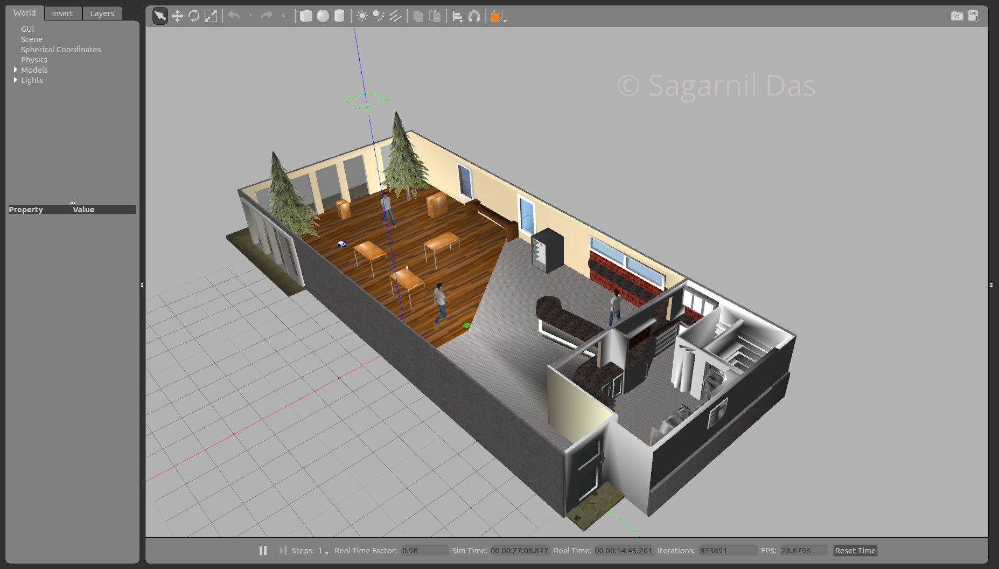
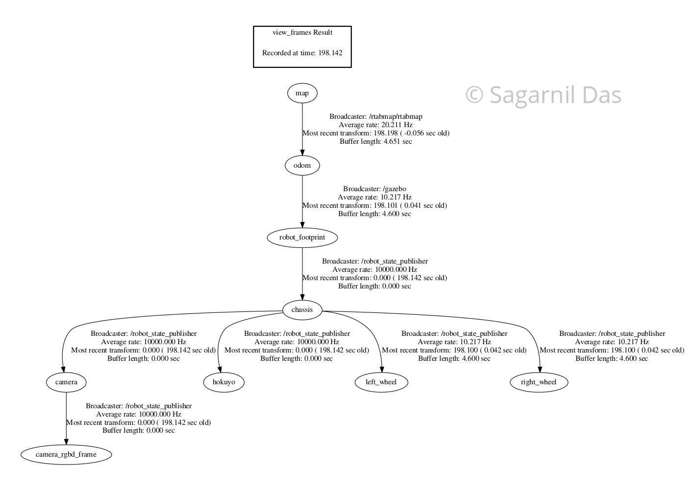

# Map My World Robot
## Abstract

This paper implements Simultaneous Localization and Mapping (SLAM) technique to construct a map of a given environment. A Real Time Appearance Based Mapping (RTAB-Map) approach was taken for accomplishing this task. Initially, a 2d occupancy grid  and 3d octomap was created from a provided simulated environment. Next, a personal simulated environment was created for mapping as well. In this appearance based method, a process called Loop Closure is used to determine whether a robot has seen a location before or not. In this paper, it is seen that RTAB-Map is optimized for large scale and long term SLAM by using multiple strategies to allow for loop closure to be done in real time and the results depict that it can be an excellent solution for SLAM to develop robots that can map an environment in both 2d and 3d.

## Introduction

In SLAM (Simultaneous Localization and Mapping), a robot must  construct a map of the environment, while simultaneously localizing itself relative to this map. This problem is more challenging than localization or mapping, since neither the map nor the robot poses are provided making this problem a 'chicken or a egg' problem. With noise in the robot's motion and measurements, the map and robot's pose will be uncertain, and the errors in the robot's pose estimates and map will be correlated. The accuracy of the map depends on the accuracy of the localization and vice versa. Given a series of sensor observations over discrete time steps , the SLAM problem is to compute an estimate of the agent’s location and a map of the environment.
In this paper, two simulation environments were provided where SLAM was performed. The robot was successfully able to localize itself and map the 3d world. The benchmark environment is called kitchen-dining (Figure 1) and the second environment is that of a cafeteria called sagar-cafe (Figure 2).


Figure 1: Robot model in Kitchen-Dining world



Figure 2: Robot model in Cafe-world

## Background

The FastSLAM algorithm uses a custom particle filter approach to solve the full SLAM problem with known correspondence. Using particles, FastSLAM estimates a posterior over the robot's path along with the map. Each of these particles hold the robot's trajectory which gives an advantage to SLAM to solve the problem of mapping with known poses. In addition to the trajectory, each particle holds a map and each feature of the map is represented by a local Gaussian.

With the FastSLAM algorithm, the problem is now divided into two separate independent problems, each of which aims to solve the problem of estimating features of the map. To solve these independent mini-problems, FastSLAM will use the low dimensional Extended Kalman Filter. While map features are treated independently, dependency only exists between robot pose uncertainty. This custom approach of representing the posterior with particle filter and Gaussian is known by Rao-Blackwellized particle filter approach. The Grid based FastSLAM is really an extension of FastSLAM and it adapts FastSLAM to grid maps.

With grid mapping algorithm, the environment can be modeled using grid maps without predefining any landmark position. So by extending the FastSLAM algorithm to occupancy grid maps, the SLAM problem can now be solved in an arbitrary environment. While mapping the real world environment, mobile robots equipped with range sensors can be used and the FastSLAM algorithm can be extended to solve the SLAM problem in terms of grid maps.

The first term in the RHS represents the robot trajectory where just as in FastSLAM, with the grid based FastSLAM, each particle holds a guess of the robot's trajectory.

The second term represents a map where each particle maintains its own. The grid based FastSLAM algorithm will update each particle by solving the mapping with known poses problem using the Occupancy grid mapping algorithm.

RTAB-Map (Real Time Appearance Based Mapping) is a graph based SLAM approach. Appearance based SLAM means that the algorithm uses data collected from vision sensors to localize the robot and map the environment. In appearance based methods, a process called Loop Closure is used to determine whether the robot has seen a location before. As the robot travels to new areas in its environment, the map is expanded and the number of images that each new image must be compared to increases. This causes the loop closure to take longer with the complexity increasing linearly. RTAB-Map is optimized for large scale and long term SLAM by using multiple strategies to allow for loop closure to be done in real time. Figure 3 shows the block diagram of the front end and the back end.


Figure 3: RTAB-Map block diagram

The front end of RTAB-Map focuses on sensor data used to obtain the constraints that are used for feature optimization approaches. Although landmark constraints are used for other graph SLAM methods like the 2d graph SLAM, RTAB-Map does not use them. Only odometry constraints and loop closure constraints are considered here. The odometry constraints can come from wheel encoders, IMU or visual odometry. Visual odometry is accomplished by 2d features such as Speeded Up Robust Features (SURF). RTAB-Map is appearance based with no metric distance information. It can use a single monocular camera to detect loop closure. For metric graph SLAM, RTAB-Map requires an RGB-D camera or a stereo camera to compute the geometric constraint between the images of a loop closure. A laser range finder can also be used to improve or refine this geometric constraint by providing a more precise location. The front end also involves graph management, which includes node creation and loop closure detection using Visual Bag of Words.

The back end of RTAB-Map includes graph optimization and assembly of an occupancy grid from the data of the graph. Loop closure detection is the process of finding a match between the current and previously visited locations in SLAM. There are two types of loop closure detection:

a) Local Loop closure detection: More probabilistic SLAM methods use Local loop closure detection, where matches are found between a new observation and a limited map region. The size and location of this limited map region is determined by the uncertainty associated with the robot's position. This type of approach fails if the estimated position is incorrect.

b) Global Loop closure detection: In this approach, a new location is compared with the previously visited locations. If no match is found, the new location is added to memory. As the map grows and more locations are added to the memory, the amount of time to check whether the location has been previously seen increases linearly. If the time it takes to search and compare new images to the one stored in memory becomes larger than the acquisition time, the map becomes ineffective. RTAB-Map uses a global loop closure approach combined with other techniques like Visual bag of words, quantization, graph optimization techniques like Tree Based Network Optimizer (TORO) or General Graph Optimization (G2O) to ensure that the loop closure process happens in real time.

## Scene and Robot configuration

The ROS package slam_project deploys the RTAB-Map to perform SLAM on two environments. The first environment is an environment provided by Udacity as a part of this research project and is named Kitchen-Dining. The second environment is a custom made environment of a cafeteria named sagar_cafe. Just like other robotics project, this project has been organized into different folders containing the meshes, Gazebo SDF files, scripts, robot model URDFs, configuration files and launch files. The following diagram depicts the file structure:


```
├── CMakeLists.txt
├── rtabmap_kitchen_dining.db
├── launch
│   ├── config
│   │   └── robot_slam.rviz
│   ├── mapping.launch
│   ├── robot_description.launch
│   ├── rviz.launch
│   ├── teleop.launch
│   └── world.launch
├── materials
│   └── textures
│       └── kinect.png
├── meshes
│   ├── hokuyo.dae
│   └── kinect.dae
├── package.xml
├── README.md
├── rtab_run
├── teleop
├── urdf
│   ├── sagar_bot.gazebo
│   └── sagar_bot.xacro
└── worlds
    ├── kitchen_dining.world
    └── sagar_cafe.world
```
The transform tree associated with the robot is shown in Figure 4.


